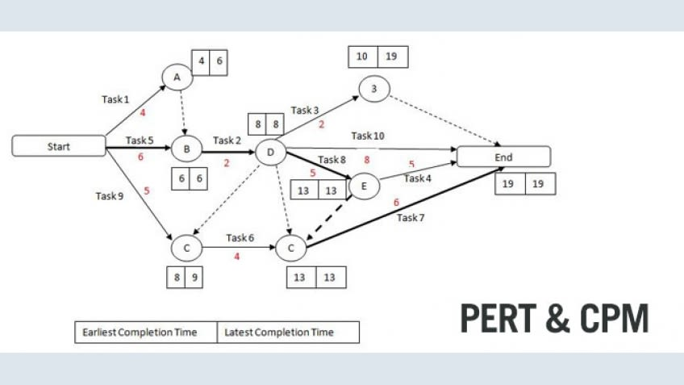

# Implementation Pert - find the shortest path

In this project i implemented pert using topological sort 

## Prerequisites

knowledge in python programming.

## What inside
 
 Topological sort algorithm using queue data structure to find the shortest path.
 
### Implementation of the exact picture below

